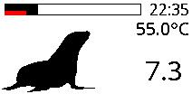

Raspberry RAID1 monitor
========================================

In my setup it has:
* Raspberry Pi 4B
* Two external HDD
* [E-Ink screen 2.13 inch](https://www.waveshare.com/wiki/2.13inch_e-Paper_HAT_(B))

Every 10 minutes it shows state of RAID array and some state of Raspberry
(So far only CPU temperature).

Seal waits to be replaced with some other useful visualisation.
